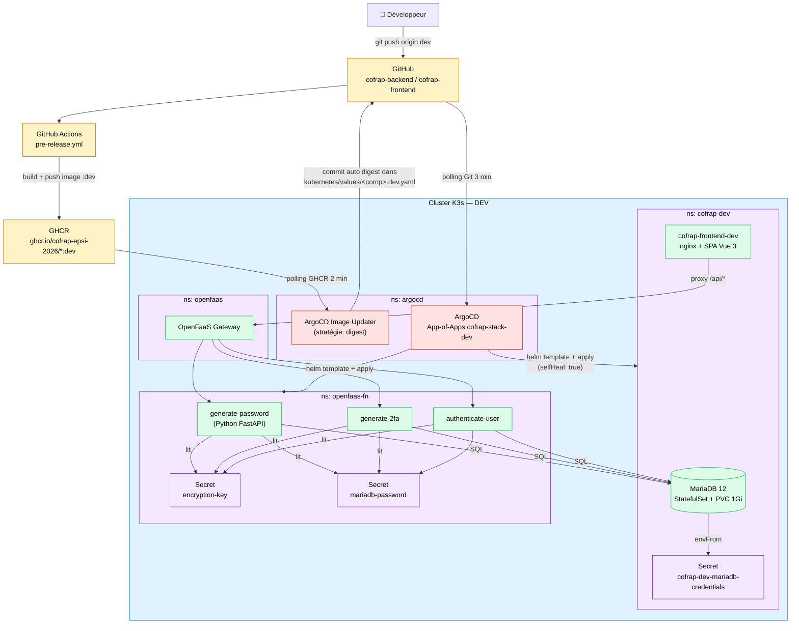
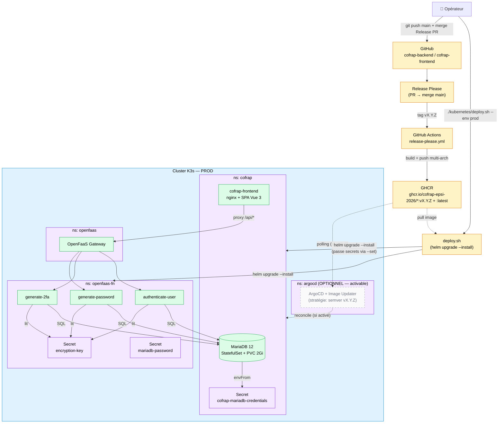
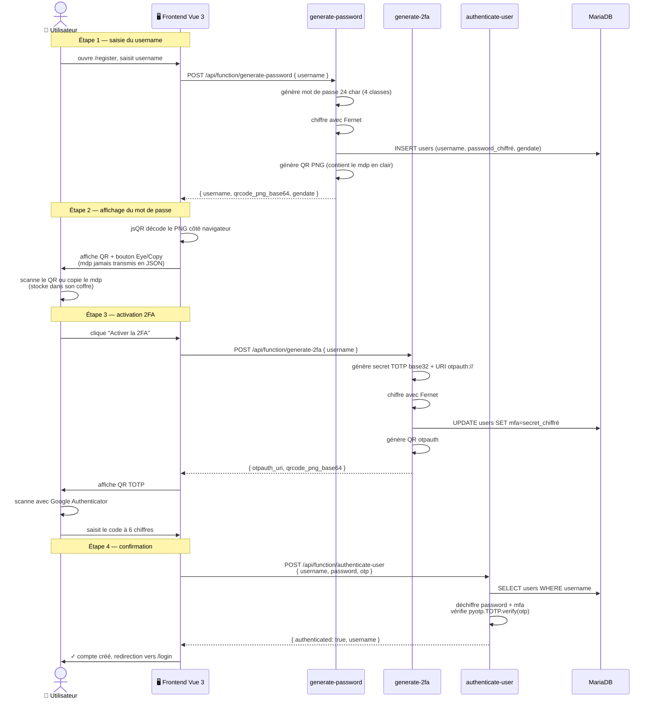
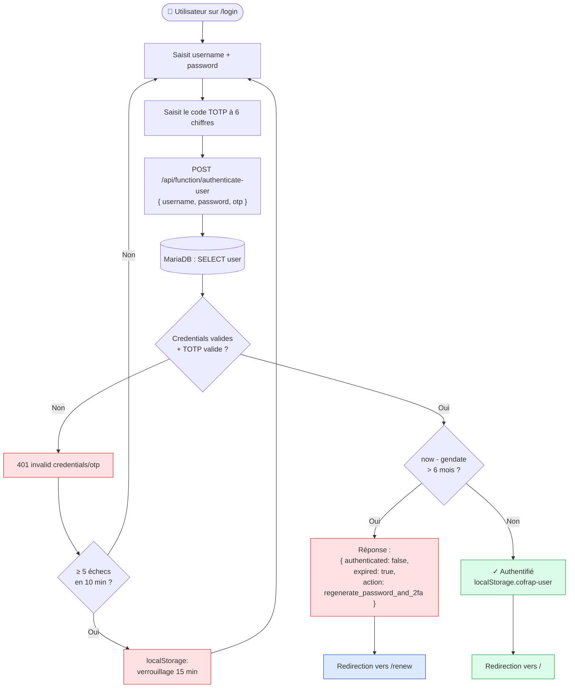
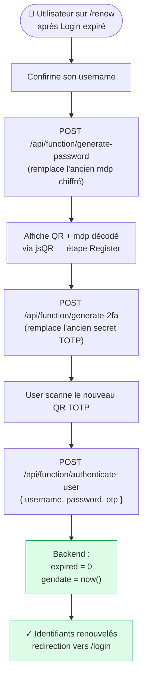

# Architecture COFRAP — vue d'ensemble

Diagrammes [Mermaid](https://mermaid.js.org/) (rendus nativement par GitHub) couvrant
trois angles complémentaires :

1. [**Architecture applicative — DEV**](#1-architecture-applicative--dev) : composants + flux GitOps
2. [**Architecture applicative — PROD**](#2-architecture-applicative--prod) : composants + déploiement scripté
3. [**Architecture réseau / infrastructure — DEV**](#3-architecture-réseau--infrastructure--dev)
4. [**Architecture réseau / infrastructure — PROD**](#4-architecture-réseau--infrastructure--prod)
5. [**Flux utilisateur**](#5-flux-utilisateur) : Register / Login / Renew (sequence diagram)

> Pour la prose détaillée (choix techniques, ADR), voir
> [`backend/docs/fr/architecture.md`](../backend/docs/fr/architecture.md) et
> [`frontend/docs/fr/architecture.md`](../frontend/docs/fr/architecture.md).
> Pour le mode de déploiement par env, voir [`kubernetes/README.md`](../kubernetes/README.md#architecture-par-environnement).

---

## 1. Architecture applicative — DEV

Mode **GitOps complet** : ArgoCD + Image Updater déploient automatiquement à chaque
push sur la branche `dev`.

**Points clés** :
- **`secrets.create: false`** : le chart ne crée plus les secrets — ils sont pré-créés via `kubernetes/create-secrets.sh --env dev` (gérés hors de Git).
- **Image Updater (stratégie digest)** suit le tag mobile `:dev` — chaque republication change le SHA256 → bump auto dans Git → ArgoCD reconcile.
- **`selfHeal: true`** : ArgoCD corrige automatiquement les drifts (quelqu'un modifie un pod à la main → ArgoCD le ramène à l'état Git).

---

## 2. Architecture applicative — PROD

Mode **scripté** (`deploy.sh`) : déploiement explicite et validé par l'humain.
**ArgoCD non activé** (mais activable — manifestes prêts dans [`kubernetes/argocd/`](../kubernetes/argocd/)).

**Différences vs DEV** :
- **`secrets.create: true`** (défaut) : le chart crée les 3 secrets à partir des valeurs passées par `deploy.sh --set`.
- **Tags semver immuables** (`v2026.X.Y`) au lieu du mobile `:dev`.
- **PVC MariaDB 2Gi** (vs 1Gi en dev).
- **ArgoCD désactivé** — bloc en pointillé : prêt à l'emploi le jour où tu veux passer en GitOps (cf. [`kubernetes/README.md` § Activer ArgoCD en prod](../kubernetes/README.md#activer-argocd-en-prod-plus-tard-optionnel)).
- **selfHeal: false** quand ArgoCD est activé (humain dans la boucle).

---

## 3. Architecture réseau / infrastructure — DEV

```mermaid
flowchart LR
    classDef extWeb fill:#fef3c7,stroke:#d97706,color:#000
    classDef edge fill:#fce7f3,stroke:#be185d,color:#000
    classDef lan fill:#dbeafe,stroke:#1d4ed8,color:#000
    classDef k8s fill:#dcfce7,stroke:#16a34a,color:#000

    User["🌐 Utilisateur<br/>(navigateur)"]:::extWeb
    DNS["DNS Cloudflare<br/>cofrap-dev.home-maurras.fr<br/>(CNAME proxied)"]:::edge
    CFE["Cloudflare Edge<br/>(TLS termination,<br/>WAF, CDN)"]:::edge

    subgraph Home["🏠 Réseau LAN — 192.168.1.0/24"]
        direction TB
        CFD["cloudflared<br/>(daemon Tunnel)<br/>↕ TLS sortant vers CF"]:::lan
        Box["Box internet<br/>(pas de port ouvert)"]:::lan

        subgraph K3sDev["Cluster K3s DEV"]
            direction TB
            VIP[/"VIP MetalLB L2<br/>192.168.1.240:80"/]:::k8s
            Traefik["Service traefik<br/>(LoadBalancer)<br/>+ Ingress controller"]:::k8s
            IngFE["Ingress cofrap-frontend-dev<br/>host: cofrap-dev.home-maurras.fr"]:::k8s
            IngArgo["Ingress argocd-server<br/>host: argocd-dev.home-maurras.fr"]:::k8s
            SvcFE["Service cofrap-frontend-dev<br/>(ClusterIP)"]:::k8s
            SvcArgo["Service argocd-server<br/>(ClusterIP)"]:::k8s
            PodFE["Pod nginx<br/>SPA + proxy /api"]:::k8s
            SvcGW["Service gateway<br/>(openfaas ns)"]:::k8s
            PodsFn["Pods fonctions<br/>(openfaas-fn ns)"]:::k8s
            PodArgo["Pod argocd-server"]:::k8s
        end
    end

    User -- "HTTPS :443" --> DNS
    DNS --> CFE
    CFE -- "TLS interne tunnel" --> CFD
    CFD -- "HTTP" --> VIP
    Box -. "❌ aucun port ouvert" .- CFE

    VIP --> Traefik
    Traefik -- "Host: cofrap-dev..." --> IngFE
    Traefik -- "Host: argocd-dev..." --> IngArgo
    IngFE --> SvcFE --> PodFE
    IngArgo --> SvcArgo --> PodArgo
    PodFE -- "/api/* → proxy_pass<br/>(même origine, pas de CORS)" --> SvcGW
    SvcGW --> PodsFn
```

**Points clés réseau** :
- **Cloudflare Tunnel sortant uniquement** : aucun port n'est ouvert sur ta box. Le daemon `cloudflared` initie la connexion vers Cloudflare → pas d'exposition directe.
- **MetalLB en mode L2** : annonce l'IP virtuelle `192.168.1.240` sur le LAN via ARP. Le Service `traefik` (LoadBalancer) prend cette IP, stable et indépendante du nœud K3s qui tourne le pod traefik.
- **Path field VIDE** dans le Cloudflare Tunnel (piège classique : `^/` ou autre regex casse tout).
- **Frontend proxifie `/api/*` côté nginx du pod** vers le gateway OpenFaaS interne — même origine pour le navigateur → aucun CORS.

---

## 4. Architecture réseau / infrastructure — PROD

Identique à dev sauf hostnames et IP MetalLB. Aucun port exposé sur la box.

```mermaid
flowchart LR
    classDef extWeb fill:#fef3c7,stroke:#d97706,color:#000
    classDef edge fill:#fce7f3,stroke:#be185d,color:#000
    classDef lan fill:#dbeafe,stroke:#1d4ed8,color:#000
    classDef k8s fill:#dcfce7,stroke:#16a34a,color:#000

    User["🌐 Utilisateur<br/>(navigateur)"]:::extWeb
    DNS["DNS Cloudflare<br/>cofrap.home-maurras.fr<br/>(CNAME proxied)"]:::edge
    CFE["Cloudflare Edge<br/>(TLS, WAF, CDN)"]:::edge

    subgraph Home["🏠 Réseau LAN — 192.168.1.0/24"]
        direction TB
        CFD["cloudflared (daemon Tunnel)"]:::lan
        Box["Box internet<br/>(pas de port ouvert)"]:::lan

        subgraph K3sProd["Cluster K3s PROD"]
            direction TB
            VIP[/"VIP MetalLB L2<br/>192.168.1.241:80"/]:::k8s
            Traefik["Service traefik (LoadBalancer)<br/>+ Ingress controller"]:::k8s
            IngFE["Ingress cofrap-frontend<br/>host: cofrap.home-maurras.fr"]:::k8s
            SvcFE["Service cofrap-frontend"]:::k8s
            PodFE["Pod nginx + SPA"]:::k8s
            SvcGW["Service gateway (openfaas ns)"]:::k8s
            PodsFn["Pods fonctions (openfaas-fn ns)"]:::k8s
        end
    end

    User -- "HTTPS :443" --> DNS
    DNS --> CFE
    CFE -- "TLS interne tunnel" --> CFD
    CFD -- "HTTP" --> VIP
    Box -. "❌ aucun port ouvert" .- CFE

    VIP --> Traefik
    Traefik -- "Host: cofrap..." --> IngFE
    IngFE --> SvcFE --> PodFE
    PodFE -- "/api/* → proxy_pass" --> SvcGW
    SvcGW --> PodsFn
```

**Différences vs DEV** :
- Hostname `cofrap.home-maurras.fr` (vs `cofrap-dev.…`)
- VIP MetalLB `192.168.1.241` (vs `.240`)
- Pas d'Ingress ArgoCD (ArgoCD non activé en prod)
- Cloudflared peut être **le même daemon** que dev (1 tunnel, 2 public hostnames) ou un daemon distinct selon ta topologie.

---

## 5. Flux utilisateur

### 5.1 Création de compte (Register)

### 5.2 Authentification (Login)

### 5.3 Renouvellement (Renew)

Déclenché par Login quand `expired: true`. Même flux que Register, mais le user existe déjà.

---

## Liens vers la doc opérationnelle

- 🚀 [`runbook-dev.md`](runbook-dev.md) — déploiement dev A → Z (GitOps actif)
- 🚀 [`runbook-prod.md`](runbook-prod.md) — déploiement prod A → Z (scripté, ArgoCD optionnel)
- 📋 [`cheatsheet.md`](cheatsheet.md) — commandes courantes (kubectl, helm, argocd…)
- 🏗 [`../kubernetes/README.md`](../kubernetes/README.md) — détail des scripts + Phase 1
- 🤖 [`../kubernetes/argocd/README.md`](../kubernetes/argocd/README.md) — détail GitOps + Image Updater
- 🔒 [`../backend/docs/fr/security.md`](../backend/docs/fr/security.md) — modèle de menace, rate-limit, rotation
